# Quantitative Volatility Platform - Architecture Documentation

**Document Version:** 1.0  
**Last Updated:** October 15, 2025  
**Author:** Solutions Architecture Team

---

## Executive Summary

The Quantitative Volatility Platform (QVP) is a production-grade, event-driven trading infrastructure designed for systematic volatility strategy research, backtesting, and simulation. Built on modern Python stack with emphasis on modularity, extensibility, and performance.

### Key Architectural Principles

- **Separation of Concerns**: Clear boundaries between data, research, execution, and analytics
- **Event-Driven Design**: Asynchronous, non-blocking architecture for realistic backtesting
- **Configuration-Driven**: Externalized configuration for environment portability
- **Production-Ready**: Comprehensive logging, error handling, and transaction cost modeling
- **Type Safety**: Full type hints for static analysis and IDE support

---

## Table of Contents

1. [System Context](#1-system-context)
2. [Container Architecture](#2-container-architecture)
3. [Component Architecture](#3-component-architecture)
4. [Data Flow Architecture](#4-data-flow-architecture)
5. [Class Design](#5-class-design)
6. [Deployment Architecture](#6-deployment-architecture)
7. [Technology Stack](#7-technology-stack)

---

## 1. System Context

### High-Level System Overview


### System Boundaries

**In Scope:**
- Historical data ingestion and storage
- Volatility estimation (5 estimators + GARCH)
- Feature engineering and regime detection
- Event-driven backtesting engine
- Portfolio optimization and risk management
- Performance analytics and reporting

**Out of Scope (Future Phases):**
- Real-time live trading execution
- Order management system (OMS)
- Risk limit enforcement in production
- Multi-asset class support

---

## 2. Container Architecture

### Application Container View


---

## 3. Component Architecture

### Core Component Breakdown


---

## 4. Data Flow Architecture

### End-to-End Data Pipeline


### Critical Data Flows

1. **Data Acquisition Flow**: Yahoo Finance → DataIngester → Validator → Parquet Cache
2. **Research Flow**: Parquet → Volatility Estimators → GARCH → Features → Strategies
3. **Backtest Flow**: Strategy Signals → Engine → Portfolio → Transaction Costs → Results
4. **Analytics Flow**: Portfolio Equity → Metrics Calculation → Risk Analysis → Tearsheet

---

## 5. Class Design

### Core Domain Model

```mermaid
classDiagram
    %% Configuration Management
    class Config {
        -_instance: Config
        -_config: Dict
        +get(key: str, default: Any) Any
        +set(key: str, value: Any) void
        +get_instance() Config
    }
    
    %% Data Layer
    class DataIngester {
        +download_equity_data(symbol: str, start: date, end: date) DataFrame
        +download_vix_data(start: date, end: date) DataFrame
        +download_options_chain(symbol: str, date: date) DataFrame
        -_clean_ohlcv_data(df: DataFrame) DataFrame
        +validate_data_quality(df: DataFrame) bool
    }
    
    class DataStorage {
        +save_to_parquet(df: DataFrame, filename: str) void
        +load_from_parquet(filename: str) DataFrame
        +list_cached_files() List~str~
        +get_cache_path(symbol: str) Path
    }
    
    %% Research Layer
    class VolatilityEstimator {
        +close_to_close(prices: Series, window: int) Series
        +parkinson(high: Series, low: Series, window: int) Series
        +garman_klass(ohlc: DataFrame, window: int) Series
        +rogers_satchell(ohlc: DataFrame, window: int) Series
        +yang_zhang(ohlc: DataFrame, window: int) Series
    }
    
    class GARCHModeler {
        +fit(returns: Series, model_type: str, p: int, q: int) ARCHModelResult
        +forecast(fitted_model: ARCHModelResult, horizon: int) DataFrame
        +get_model_summary(fitted_model: ARCHModelResult) str
    }
    
    class ImpliedVolatility {
        +black_scholes_call(S: float, K: float, T: float, r: float, sigma: float) float
        +black_scholes_put(S: float, K: float, T: float, r: float, sigma: float) float
        +implied_volatility_newton(price: float, S: float, K: float, T: float, r: float) float
    }
    
    class TechnicalIndicators {
        +rsi(prices: Series, period: int) Series
        +macd(prices: Series) Tuple~Series~
        +bollinger_bands(prices: Series, window: int, num_std: float) Tuple~Series~
        +atr(ohlc: DataFrame, period: int) Series
    }
    
    class VolatilityFeatures {
        +volatility_spread(realized_vol: Series, implied_vol: Series) Series
        +volatility_ratio(vol1: Series, vol2: Series) Series
        +volatility_zscore(vol: Series, window: int) Series
    }
    
    class RegimeDetection {
        +threshold_regimes(vol: Series, low_thresh: float, high_thresh: float) Series
        +kmeans_regimes(features: DataFrame, n_clusters: int) Series
        +quantile_regimes(vol: Series, quantiles: List~float~) Series
    }
    
    class MLFeatureEngine {
        -scaler: StandardScaler
        -pca: PCA
        +create_features(ohlc: DataFrame, vol: Series) DataFrame
        +fit_transform(features: DataFrame, n_components: int) DataFrame
    }
    
    %% Backtesting Engine
    class Order {
        <<dataclass>>
        +timestamp: datetime
        +symbol: str
        +order_type: OrderType
        +side: OrderSide
        +quantity: float
        +price: float
        +status: OrderStatus
    }
    
    class Fill {
        <<dataclass>>
        +timestamp: datetime
        +symbol: str
        +side: OrderSide
        +quantity: float
        +price: float
        +commission: float
        +slippage: float
    }
    
    class Portfolio {
        -cash: float
        -positions: Dict~str, float~
        -equity_curve: List~float~
        +process_fill(fill: Fill) void
        +get_position(symbol: str) float
        +get_equity(current_prices: Dict~str, float~) float
        +get_returns() Series
    }
    
    class TransactionCostModel {
        -commission_rate: float
        -slippage_bps: float
        +calculate_commission(fill: Fill) float
        +calculate_slippage(fill: Fill) float
        +apply_costs(fill: Fill) Fill
    }
    
    class Strategy {
        <<abstract>>
        +on_bar(timestamp: datetime, data: Dict) List~Order~*
        +on_fill(fill: Fill) void*
        #calculate_position_size(signal: float) float*
    }
    
    class BacktestEngine {
        -portfolio: Portfolio
        -strategy: Strategy
        -cost_model: TransactionCostModel
        +run(data: DataFrame, initial_capital: float) DataFrame
        -_process_bar(timestamp: datetime, bar_data: Series) void
        -_execute_orders(orders: List~Order~, current_price: float) void
    }
    
    %% Strategies
    class VIXMeanReversionStrategy {
        -lookback_period: int
        -entry_zscore: float
        -exit_zscore: float
        +on_bar(timestamp: datetime, data: Dict) List~Order~
    }
    
    class VolatilityRiskPremiumStrategy {
        -threshold: float
        -holding_period: int
        +on_bar(timestamp: datetime, data: Dict) List~Order~
    }
    
    class SimpleVolatilityStrategy {
        -vix_threshold: float
        +on_bar(timestamp: datetime, data: Dict) List~Order~
    }
    
    %% Portfolio Optimization
    class PortfolioOptimizer {
        +mean_variance_optimization(returns: DataFrame, target_return: float) ndarray
        +minimum_variance(returns: DataFrame) ndarray
        +maximum_sharpe(returns: DataFrame, risk_free_rate: float) ndarray
        +apply_constraints(weights: ndarray, constraints: Dict) ndarray
    }
    
    class RiskParityOptimizer {
        +risk_parity_weights(cov_matrix: ndarray) ndarray
        +risk_contribution(weights: ndarray, cov_matrix: ndarray) ndarray
    }
    
    %% Risk Management
    class RiskMetrics {
        +value_at_risk(returns: Series, confidence: float, method: str) float
        +conditional_var(returns: Series, confidence: float) float
        +downside_risk(returns: Series, threshold: float) float
        +max_drawdown(equity_curve: Series) float
    }
    
    class StressTesting {
        +apply_stress_scenario(portfolio: Portfolio, scenario: Dict) float
        +monte_carlo_simulation(returns: Series, n_sims: int) ndarray
    }
    
    class RiskLimitMonitor {
        -limits: Dict
        +check_limits(portfolio: Portfolio, metrics: Dict) bool
        +get_violations() List~str~
    }
    
    %% Performance Analytics
    class PerformanceMetrics {
        +sharpe_ratio(returns: Series, risk_free_rate: float) float
        +sortino_ratio(returns: Series, risk_free_rate: float) float
        +calmar_ratio(returns: Series, equity_curve: Series) float
        +max_drawdown(equity_curve: Series) float
        +win_rate(returns: Series) float
        +calculate_all_metrics(returns: Series, equity_curve: Series) Dict
    }
    
    class RollingMetrics {
        +rolling_sharpe(returns: Series, window: int) Series
        +rolling_volatility(returns: Series, window: int) Series
        +rolling_beta(returns: Series, benchmark: Series, window: int) Series
    }
    
    %% Relationships
    Config --|> DataIngester : configures
    Config --|> BacktestEngine : configures
    
    DataIngester --> DataStorage : uses
    
    VolatilityEstimator --> DataIngester : uses
    GARCHModeler --> VolatilityEstimator : uses
    TechnicalIndicators --> DataIngester : uses
    VolatilityFeatures --> VolatilityEstimator : uses
    MLFeatureEngine --> VolatilityFeatures : uses
    
    Strategy <|-- VIXMeanReversionStrategy : implements
    Strategy <|-- VolatilityRiskPremiumStrategy : implements
    Strategy <|-- SimpleVolatilityStrategy : implements
    
    VIXMeanReversionStrategy --> VolatilityFeatures : uses
    VIXMeanReversionStrategy --> TechnicalIndicators : uses
    
    BacktestEngine --> Portfolio : manages
    BacktestEngine --> Strategy : executes
    BacktestEngine --> TransactionCostModel : uses
    BacktestEngine ..> Order : creates
    
    Portfolio ..> Fill : processes
    TransactionCostModel ..> Fill : modifies
    
    PortfolioOptimizer --> RiskMetrics : uses
    RiskLimitMonitor --> RiskMetrics : uses
    
    PerformanceMetrics --> Portfolio : analyzes
    RollingMetrics --> Portfolio : analyzes
```



### Key Design Patterns

1. **Singleton Pattern**: Config class ensures single configuration instance
2. **Strategy Pattern**: Modular strategy implementations via abstract base class
3. **Factory Pattern**: Strategy instantiation based on configuration
4. **Observer Pattern**: Event-driven backtesting with callbacks
5. **Template Method**: Base strategy class with hooks for customization

---

## 6. Deployment Architecture

### Development Environment


### Future Production Environment (Conceptual)


---

## 7. Technology Stack

### Technology Decision Matrix


### Technology Justifications

| Technology | Purpose | Justification |
|------------|---------|---------------|
| **Python 3.10+** | Primary language | Type hints, performance, ecosystem |
| **NumPy/pandas** | Data processing | Industry standard, optimized C backends |
| **yfinance** | Market data | Free, reliable, comprehensive |
| **arch** | GARCH modeling | Specialized volatility forecasting |
| **cvxpy** | Optimization | Convex optimization, multiple solvers |
| **Parquet** | Data storage | Columnar, compressed, efficient queries |
| **pytest** | Testing | Fixtures, parametrization, plugins |
| **loguru** | Logging | Structured logging, rotation, threading |

---

## Appendix

### A. Configuration Schema

```yaml
# config/config.yaml structure
data:
  cache_dir: str              # Data cache directory
  default_start_date: str     # Default start for downloads
  quality_threshold: float    # Data quality minimum
  
research:
  default_window: int         # Volatility window
  garch_order: [int, int]     # GARCH(p,q)
  
backtest:
  initial_capital: float      # Starting capital
  commission_rate: float      # Per-trade commission
  slippage_bps: float        # Slippage in basis points
  
risk:
  var_confidence: float       # VaR confidence level
  max_position_size: float    # Position limit
  max_leverage: float         # Leverage limit
```

### B. Directory Structure

```
qvp_poc/
├── qvp/                    # Main package
│   ├── __init__.py         # Package initialization
│   ├── config.py           # Configuration management
│   ├── data/               # Data layer
│   │   ├── __init__.py
│   │   └── ingestion.py    # Data ingestion
│   ├── research/           # Research layer
│   │   ├── __init__.py
│   │   ├── volatility.py   # Volatility estimators
│   │   ├── garch.py        # GARCH models
│   │   └── features.py     # Feature engineering
│   ├── backtest/           # Backtesting
│   │   ├── __init__.py
│   │   └── engine.py       # Backtest engine
│   ├── strategies/         # Trading strategies
│   │   ├── __init__.py
│   │   └── volatility_strategies.py
│   ├── portfolio/          # Portfolio management
│   │   ├── __init__.py
│   │   └── optimization.py
│   ├── risk/               # Risk management
│   │   ├── __init__.py
│   │   └── risk_management.py
│   └── analytics/          # Performance analytics
│       ├── __init__.py
│       └── performance.py
├── scripts/                # Executable scripts
│   ├── run_demo.py
│   └── example_volatility.py
├── tests/                  # Unit tests
│   ├── conftest.py
│   ├── test_volatility.py
│   └── test_backtest.py
├── config/                 # Configuration files
│   └── config.yaml
├── data/                   # Data directory (git-ignored)
│   ├── cache/
│   └── results/
├── docs/                   # Documentation
│   ├── ARCHITECTURE.md     # This file
│   └── API.md
├── pyproject.toml          # Project metadata
├── requirements.txt        # Dependencies
├── .env                    # Environment variables
└── README.md               # Main documentation
```

### C. Glossary

- **GARCH**: Generalized Autoregressive Conditional Heteroskedasticity
- **VaR**: Value at Risk
- **CVaR**: Conditional Value at Risk (Expected Shortfall)
- **IV**: Implied Volatility
- **RV**: Realized Volatility
- **VIX**: CBOE Volatility Index
- **PCA**: Principal Component Analysis
- **OHLCV**: Open, High, Low, Close, Volume
- **P&L**: Profit and Loss
- **Parquet**: Apache Parquet columnar storage format
- **Snappy**: Google's compression algorithm

---

**Document Status:** Production-Ready  
**Review Cycle:** Quarterly  
**Next Review:** January 2026
